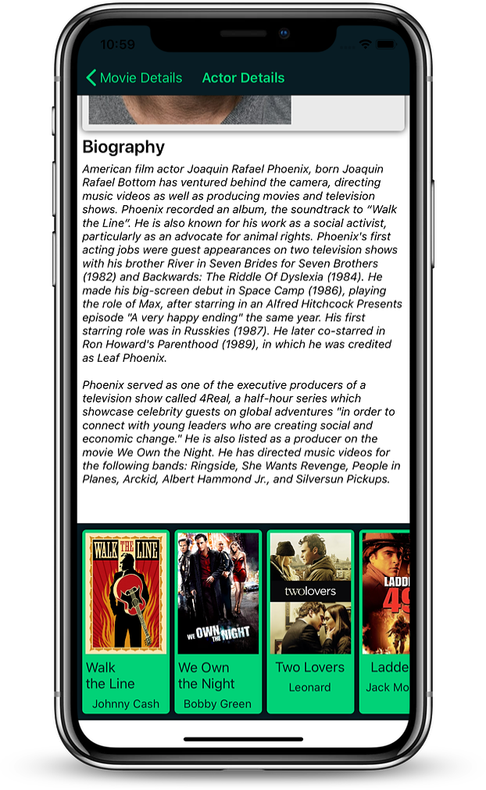

# FilmDB in Xamarin Forms

It is my homework for the Klienoldali subject in Xamarin Forms.
The app is using [The Movie DB](https://www.themoviedb.org) API to show popular movies/series.

### The App is optimalized for Android 

## Features
- Show popular movies and series
- Show movies/series details:  
    - Name
    - Picture
    - Released Date
    - Score
    - Overview
    - Language
    
- Browse episodes from seasons
- Browse movie's casts and similar/recommended movies
- Show actor details: 
    - Name
    - Gender
    - Birthday and place
    - Biography
    - Films that he/she plays
- Search Movies or Series

## Android Screenshots

 
 
 
 
 
 

## iOS Screenshots

 
 
 
 
 
 

